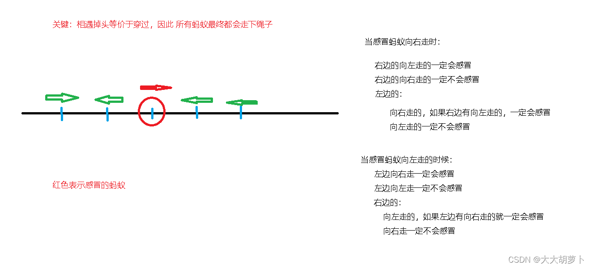

# [蓝桥杯 2014 省 AB] 蚂蚁感冒

## 题目描述

长100厘米的细长直杆子上有n只蚂蚁。它们的头有的朝左，有的朝右。

每只蚂蚁都只能沿着杆子向前爬，速度是1厘米 / 秒。

当两只蚂蚁碰面时，它们会同时掉头往相反的方向爬行。

这些蚂蚁中，有 1 只蚂蚁感冒了。并且在和其它蚂蚁碰面时，会把感冒传染给碰到的蚂蚁。

请你计算，当所有蚂蚁都爬离杆子时，有多少只蚂蚁患上了感冒。

## 输入格式

第一行输入一个整数 n(1<n<50) 表示蚂蚁的总数。

接着的一行是 n个用空格分开的整数 Xi(-100<X_i<100)，Xi 的绝对值，表示蚂蚁离开杆子左边端点的距离。正值表示头朝右，负值表示头朝左，数据中不会出现 0值，也不会出现两只蚂蚁占用同一位置。其中，第一个数据代表的蚂蚁感冒了。

## 输出格式

要求输出 1 个整数，表示最后感冒蚂蚁的数目。

## 样例 #1

### 样例输入 #1

```
3
5 -2 8
```

### 样例输出 #1

```
1
```

## 样例 #2

### 样例输入 #2

```
5
-10 8 -20 12 25
```

### 样例输出 #2

```
3
```
## 思路
 这个题就和脑筋急转弯一样
 关键要想明白，两个蚂蚁在相撞的时候掉头，其实蚂蚁没有任何区别，速度也一样，其实就相当于两个蚂蚁互相穿过了。因此只要对向而走的蚂蚁一定会被感染。
 因此就可以根据感冒的蚂蚁的初始方向进行分类了。
 


### 上代码
```c
#include <iostream>
#include <cstring>
#include <algorithm>
#include <cmath>

using namespace std;
const int N = 55;
int q[N];

int main()
{
    int n;
    cin>>n;
    for(int i=0;i<n;i++) cin>>q[i];
    //先统计感冒蚂蚁的右边向左走和左边向右走的蚂蚁个数
    int rtol=0,ltor=0;
    for(int i=0;i<n;i++){
        if(abs(q[i])>abs(q[0]) && q[i]<0) rtol++;
        if(abs(q[i])<abs(q[0]) && q[i]>0) ltor++;
    }
    int res=1;
    if(q[0]<0){//感冒的蚂蚁向左走
        res+=ltor;
        if(ltor) res+=rtol;
    }else{
        res+=rtol;
        if(rtol) res+=ltor;
    }
    cout<<res<<endl;
    return 0;
}
```