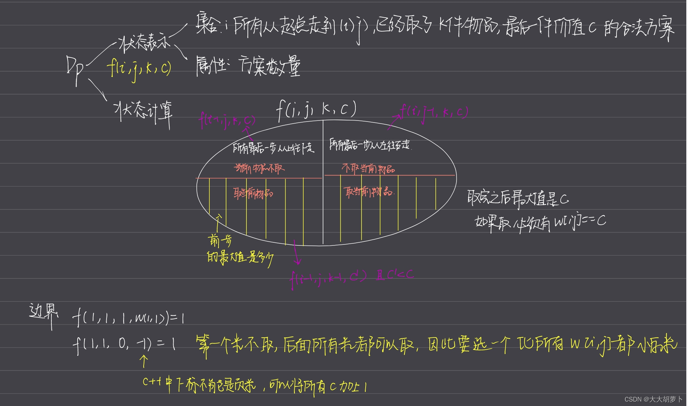

# [蓝桥杯 2014 省 AB] 地宫取宝

## 题目描述

X 国王有一个地宫宝库。是 n*m个格子的矩阵。每个格子放一件宝贝。每个宝贝贴着价值标签。

地宫的入口在左上角，出口在右下角。

小明被带到地宫的入口，国王要求他只能向右或向下行走。

走过某个格子时，如果那个格子中的宝贝价值比小明手中任意宝贝价值都大，小明就可以拿起它（当然，也可以不拿）。

当小明走到出口时，如果他手中的宝贝恰好是 k件，则这些宝贝就可以送给小明。

请你帮小明算一算，在给定的局面下，他有多少种不同的行动方案能获得这 k件宝贝。

## 输入格式

输入一行3个整数，用空格分开：n，m，k(1<=n,m <= 50,1 <= k <= 12)。

接下来有n行数据，每行有 m个整数 Ci(0 <= Ci <= 12) 代表这个格子上的宝物的价值。

## 输出格式

要求输出一个整数，表示正好取 k个宝贝的行动方案数。该数字可能很大，输出它对 1000000007(10^9+7)取模的结果。

## 样例 #1

### 样例输入 #1

```
2 2 2
1 2
2 1
```

### 样例输出 #1

```
2
```

## 样例 #2

### 样例输入 #2

```
2 3 2
1 2 3
2 1 5
```

### 样例输出 #2

```
14
```

## 提示

时限 1 秒, 256M。蓝桥杯 2014 年第五届省赛

### 实现思路
1.这个题首先要明确，只能向下或者向右走
2.格子中的数要比手中拿到的任意数字都要大才能拿这个宝贝，也就是说是价值是严格递增来取的。
3.从入口走到出口是恰好拿k件物品



### 代码
```c
#include <iostream>
#include <cstring>
#include <algorithm>

using namespace std;

const int N = 55,MOD=1000000007;
int f[N][N][13][14];
int w[N][N];
int main()
{
    int n,m,k;
    cin>>n>>m>>k;
    for(int i=1;i<=n;i++)
        for(int j=1;j<=m;j++)
        {
            cin>>w[i][j];
            w[i][j]++;//减少下标是负数的特判，将所有的价值都加一
        }
    
    f[1][1][1][w[1][1]]=1;
    f[1][1][0][0]=1;//第一个数取还是不取的方案初始化
    
    for(int i=1;i<=n;i++){
        for(int j=1;j<=m;j++){
            if(i==1 && j==1) continue;
            //循环k
            for(int u=0;u<=k;u++){
                //循环价值
                for(int v=0;v<=13;v++){
                    int &val=f[i][j][u][v];
                    val=(val+f[i-1][j][u][v])%MOD;
                    val=(val+f[i][j-1][u][v])%MOD;
                    if(u>0 && w[i][j]==v){//只有当可以取当前数，并且严格递增也就是取完之后w[i][j]一定是最大值c
                        for(int c=0;c<v;c++){
                            val=(val+f[i-1][j][u-1][c])%MOD;
                            val=(val+f[i][j-1][u-1][c])%MOD;
                        }
                    }
                }
            }
        }
    }
    int res=0;
    for(int i=0;i<=13;i++) res=(res+f[n][m][k][i])%MOD;
    cout<<res<<endl;
    return 0;
}
```