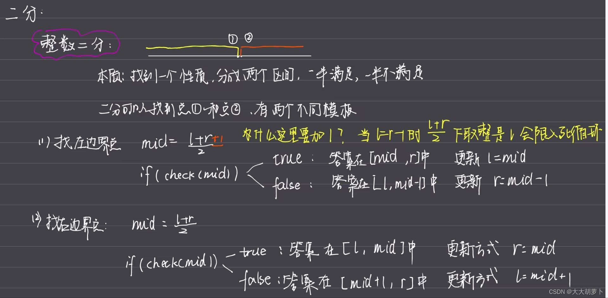

#  二分法
## 整数二分
二分的本质：找到一个性质能够把整个区间分成两部分，一半满足这个性质，一半不满足这个性质。
整数二分有两个模板：
主要问题是性质的寻找和区间的不断更新。


### 题目--求数的范围
给定一个按照升序排列的长度为 n 的整数数组，以及 q 个查询。

对于每个查询，返回一个元素 k 的起始位置和终止位置（位置从 0 开始计数）。

如果数组中不存在该元素，则返回 -1 -1。

输入格式
第一行包含整数 n 和 q，表示数组长度和询问个数。

第二行包含 n 个整数（均在 1∼10000 范围内），表示完整数组。

接下来 q 行，每行包含一个整数 k，表示一个询问元素。

输出格式
共 q 行，每行包含两个整数，表示所求元素的起始位置和终止位置。

如果数组中不存在该元素，则返回 -1 -1。

>数据范围
1≤n≤100000
1≤q≤10000
1≤k≤10000

>输入样例：
6 3
1 2 2 3 3 4
3
4
5

>输出样例：
3 4
5 5
-1 -1

==这道题就可以用二分来求解==
**思路：**
首先求第一个数x的位置，可以考虑性质mid为大于等于x，这样如果mid符合要求就一定在x右边，因此要求出x的值，就可以把区间缩小成【l，mid】。如果mid不符合要求就一定在x左边，就可以将区间缩小成【mid+1，r】。
同理当我们想求出最后出现的x的位置，可以将性质设定为mid是否小于等于x。如果mid符合要求，那么一定在x的左边，可以将区间缩小成【mid，r】，否则mid一定在x的右边，可以将区间缩小成【l，mid-1】。

```c
#include<iostream>

using namespace std;

const int N=100010;

int q[N];

int main(){
    int n,m;
    scanf("%d%d",&n,&m);
    for(int i=0;i<n;i++) scanf("%d",&q[i]);
    
    while(m--){
        int x;
        scanf("%d",&x);
        
        int l=0,r=n-1;
        while(l<r){
            int mid = l + r >> 1;
            if(q[mid]>=x) r=mid;
            else l=mid+1;
        }
        
        if(q[l]!=x) cout<<"-1 -1"<<endl;
        else{
            cout<<l<<" ";
            int l=0,r=n-1;
            while(l<r){
                int mid = l + r + 1 >> 1;
                if(q[mid]<=x) l=mid;
                else r=mid-1;
            }
            cout<<l<<endl;
        }
    }
    
    return 0;
}
```
==要注意mid取值时是取（l+r）/2还是（l+r+1）/2。==
当区间更新为【mid，r】的情况，需要加1。也就是这时l被更新成mid，可以考虑如果l=r-1，那么（l+r）/2等于l。因此c++里除法是下取整。这样会导致区间更新成【l，r】相当于没有更新，因此会陷入死循环。


## 浮点数二分
浮点数二分比整数二分要简单，不需要考虑边界问题。每次只需要保证l=mid或者r=mid，使答案一定落在某个区间里即可。
### 求算术平方根

```c
#include<iostream>

using namespace std;

/*
*二分法求平方根
**/
int main(){
    double x;
    cin>>x;
    double l=0,r=x+1;//要扩大x的范围，因为有0.01的平方根是0.1的这种平方根比原数大的情况
    while(r-l>1e-8){
        double mid=(l+r)/2;
        if(mid*mid>=x) r=mid;
        else l=mid;
    }
    printf("%lf",l);
    
    return 0;
}
```
### 求三次方根

```c
#include<iostream>

using namespace std;

/*
*二分法求三次方根
**/
int main(){
    double n;
    cin>>n;
    double l=-10000,r=10000;
    while(r-l>1e-8){
        double mid=(l+r)/2;
        if((mid*mid*mid)>=n) r=mid;
        else l=mid;
    }
    printf("%lf",l);
    return 0;
}
```
