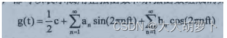
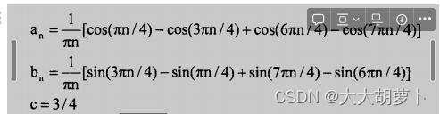
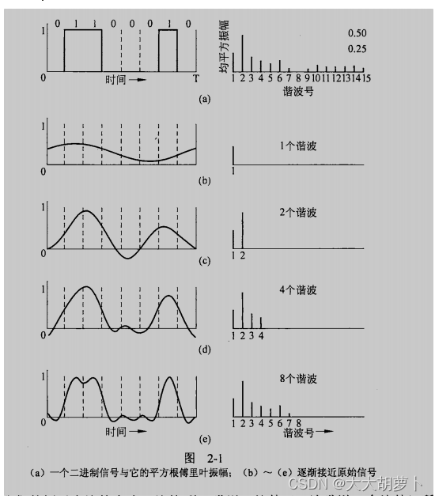
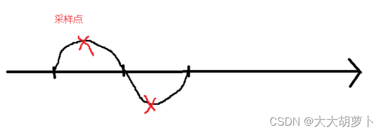
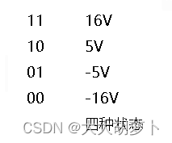
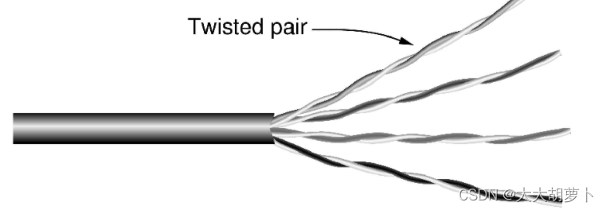
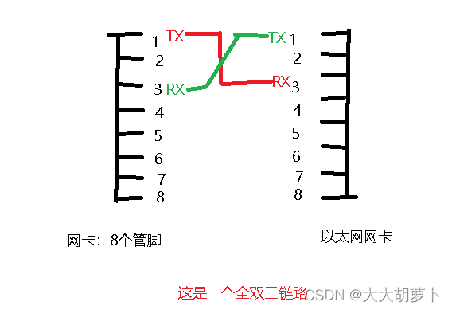
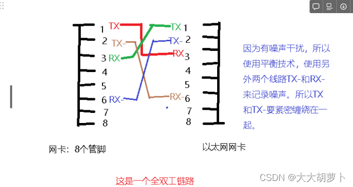
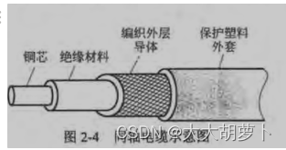
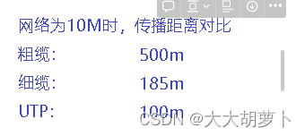

物理层是参考模型的第1层，工作环境是**相邻的两台设备**。讲述比特作为信号在信道上递交时的协议，包括信号转换、信道使用等内容。

# 一.数据通信的理论基础

首先给定一个传输介质，信号在传导时有衰减。每种介质都有一个临界值，设为fc，只有当传输信号残留的能量值大于fc，才可以通过信道传递给接收方。

注意：信号的频率不同衰减的程度也不同，频率越高衰减越快。

通信系统的任务：**数据→信号→在介质上传输→信号→数据**

**信息和数据（0、1比特）不能直接在介质上传输。**

## 1.相关概念：

**信道**：用于传输信号的一个物理通道。可以是一个传输导线，也可以是一个频率范围，或几个传输导线的传输能力的复合。

**（介质的）带宽**：传输过程中能量（振幅）不会明显衰减的频率的宽度。对一根导线， （截止频率）。

带宽：在介质上单位时间内传递的bit位数。

**基准频率**：周期的倒数（每秒发送多少这样的信号）。一种信号包含**一种或多种频率成分**（方波含有很多种频率成分，以示波器为例）。每种成分都是基准频率的倍数。

当信号在信道中传输时，高于信道截止频率的频率成分将由于能量衰减过多而不能通过信道。通过信道的只能是低于截止频率的成分。（低频部分称为概貌，高频部分称为细节。）

信号会发生变形，能否准确识别，依赖于通信双方的约定（信号发送设备和信号接收设备的）。通信双方需要根据能够传输过去的频率成分考虑合适的调制（编码）和解调制（解码），即什么样的信号对应什么样的比特（组合）。

## 2.数学基础—傅里叶变换

表示了波的分解与合成。

其中， f=  1/T是基本频率， an bn 次谐波 harmonics ）的正弦振幅和余弦振幅，是常数。这种分解称为傅里叶级数（Fourier series ）。利用傅里叶级数可以重构出函数，也就是说，如果己知周期 ，并且给定振幅，则用以上等式进行求和可以得到时间的原始函数 g(t）。

## 3.对于带宽有限的信号

上述数学分析与数据通信的关联在于**实际信道对不同频率信号有不同的影响。**

我们考虑一个特殊的例子：传输 ASCII 字符 。该字符被编码成一个 比特长的字节，发送的比特模式是 01100010 。图 2-1 (a ）的左半部分显示了计算机传输该字符时的电压输出。对该信号进行傅里叶分析，可以得到以下的系数：

对应频率的传输能力与均方根振幅成正比。

**带宽**是传输介质的一种物理特性，通常取决于介质的构成、厚度和电线或者光纤的长度。滤波器一般可用来进一步限制信号的带宽。

一般将从 到某个最大频率的信号称**为基带（bas eband ）信号**，将被搬移并占用某个更大频率范围的信号称为**通带（passband ）信号**，通带信号与所有的无线传输情况一样。

对于数字传输来说，目标是接收到的信号具有足以重构出原始发送比特序列的精度。也就是在传输过去8个谐波的情况，识别方就已经可以识别出这个信号的高低起伏了。全部传过去就造成了速度上的浪费。

下面看一个例子：约定：每一个周期信号表示8位，信道带宽为3000hz。

这些数字清楚地表明，要想在语音级电话线上以 9600 bps 的速率发送数据，必须将图 2-1 (a ）所示的信号变换成2-1 （c ）所示的信号。如此精确地接收原始的二进制比特流需要更复杂的工作。应该看到，**即使传输设备没有任何噪声，也不可能以高于 38.4 kbps 的数据速率传输任何二进制信号（没有谐波传过去了）**。换句话说，限制了带宽也就限制了数据传输率，即使对理想的信道也是如此。然而，一些采用了几级电压值的编码模式可以获得更高的数据传输率。

## 4.信道的最大传输速率

### 尼奎斯特采样定理（理想状态）

尼奎斯特采样定理给出了数字设备完整接收（保存，能够依赖采样值完整复原）一个模拟信号最多需要的采样次数。

**表达一**：对于一个时间信号f(t)，如果其最大频率为fmax，那么以2fmax的采样频率采样信号，则依赖采样值可以完整复原信号。

**表达二**：任意一个信号通过了一个带宽为B的低通滤波器（只允许低频率成分通过），那么只要进行每秒2B次（确切）采样，就可以依赖采样值完整复原出能够通过的信号（被过滤后的信号）

 直观的解释（证明见相关文献）：
根据傅里叶变换，每个周期信号可以看作由多个频率不同的正弦函数和余弦函数叠加而成。
对每一个正弦（余弦）函数，如果其频率为f，则需要2f个（确切）采样点就可以完全恢复。这两个采样点可以分别对应振幅最大值和最小值，可以明确信号频率及取值（恢复信号需要）。
如果采样频率大于2f，不影响信号恢复，但是有冗余。但是冗余采样不会包含更多的信息。
如果采样频率小于2f，则会丢失部分信息，无法完全复原信号。进而影响接收识别过程。

**表达三**：给定一个带宽为B的信道，则这个信道的最大数据传输速率为：

其中：

2B表示信道上的最大采样频率。
V表示采样信号被量化时使用的离散等级。即每个采样点有多少个状态。比如两种状态可以表示1位信号，4种状态可以表示2位信号等等。

log2V 是表达采样值时采用的二进制位数。

这个公式给出了物理介质带宽（Hz）与数字带宽（bps）之间的关系。V取决于发送和接收设备。

采用波的角度考虑：
这里的左边B表示每个信号的带宽，V的平方表示每个信号有多少个状态。

### 香农定理（现实状态）

对于一个带宽为Bhz、信噪比为S/N的信道，则这个信道的最大数据传输速率为：

两个公式的注解：
带宽B实际上为一个信道支持的最大频率fmax与最小频率fmin的差值，即B=fmax-fmin。

# 二.引导性传输介质

## 1.双绞线

双绞线可以分成几大类。部署在许多办公大楼内的称为 类线（ Category 5 ）或“猫 5 ”(Cat  5）。 5类双绞线由两根绝缘导线轻轻地扭在一起， 对这样的双绞线被套在一个塑料保护套内。塑料外套既保护了双绞线又把多根导线捆在一起。

到6类为止，所有的双绞线都称为**非屏蔽双绞线（UTP, Unshielded Twisted Pair ）**，这些双绞线仅由导线和绝缘层简单地构成。

可以双向同时使用的链路称为**全双工 （full-deplex ）链路**，就像双车道一样：相对应地，可以双向使用但一次只能使用一个方向的链路称为**半双工链路 （half-duplex ）**，就像单轨铁路线；第三类，只允许一个方向上传输的链路则称为**单工链路（simplex ）**，就像单行街一样。

图示：有4对双绞线的5类UTP

主频为125MHZ

由于在传输过程中有噪声，我们在传输时发送方发送的消息到接收方会被衰减，因此在使用两条线，来记录噪声。

## 2.同轴电缆coaxial cable

因为同轴电缆用的是铜芯，而双绞线用的是铜丝，有电阻区别，因此它比非屏蔽双绞线有更好的屏蔽特性和更大的带宽，所以它能以很高的速率传输相当长的距离。

## 3.光纤

光纤内部是玻璃纤维

<!--  -->

## 4.电磁频谱
<!--  -->

通过电磁频谱以及公式c=波长*频率可以知道，无线电波如果频率取10^6，
他的波长是300米，不是很容易被建筑物挡住。但是微波，如果取频率为10^10，那么波长为0.03m，非常容易受到天气等各种干扰。

# 三.公共电话交换网络PSTN, Public Switched Telephone Network
<!-- 

 -->
 网络层次性组织的好处：可以减少查找所需要的数量级。比如整个世界的号码15位，然后都放在一个表中查询，复杂度就是O（10^15），但如果分级查询，在每层需要查询的复杂度都不超过O(10^4)。

> 针对PSTN要解决的技术问题：1.本地到端局的信号调制解调制问题  2.中间传输的多线路复用问题  3.在交换局的交换技术。
> 

## 1.本地回路

传统双线电话线路上**传递模拟信号**。本地回路关注如何使用**模拟信号尽可能快速的传递数据**。主要设备是**调制解调器**，**调制是将数据转换为模拟信号，解调制是将模拟信号转换为数据**。根据发展历史，调制解调器可以分为使用**4k带宽的电话调制解调器**和使用**1.1M带宽的宽带调制解调器（ADSL调制解调器）。**

## 2.调制解调器：

### 电话调制解调器

电话调制解调器**使用电话的4k带宽**，所以电话和数据传输不能同时进行。

第一代使用2400个符号（采样信号），通过调整每个符号能够表达的数据位数不断提高数据传输速率。
第二代使用8k个符号（采样信号）。理论上可以达到很高的数据传输速率，但是由于香农定理的限制，极限值为35k或70kbps。

### ADSL调制解调器（非对称数字用户线 ADSL, Asymmetric DSL ）

ADSL调制解调器**使用本地回路的全部1.1M带宽**，电话和数据传输能够同时进行。
采用频分多路复用技术将1.1M带宽划分为256个4k信道，一个用于电话传输，5个空闲（隔离），防止语音信号和数字信号相互干扰，其它用于数据传输。用于数据传输的信道根据信道质量动态采用不同的调制速率，大部分信道用于下行数据传输（到用户），小部分信道用于上行数据传输（从用户）。
<!--  -->

典型的 ADSL 部署结构如图 2-35 所示。在这种方案中，电话公司的技术人员必须在客户住所安装一个**网络接口设备（NID, Network Interface Device ）**。这个小的塑料盒代表了电话公司财产的终结和客户财产的开始。靠近 NID （有时候组合在一起）是一个分离器（ splitter),分离器是一个模拟滤波器，它将 POTS 使用的 4000Hz 频段与数据分开。 POTS 信号被路由到己有的电话机或者传真机，而数据信号则被路由到 ADSL 调制解调器，。该调制解调器使用数字信号处理器来实现 OFDMo 由于当前大多数的 ADSL 调制解调器都是外置的，所以计算机必须通过高速方式与它相连。通常的做法是，使用以太网、 USB 电缆或者 802.l l 。

在线路的另一头（即电话公司端局）也要安装一个对应的分离器。在这里，信号中的
语音部分被过滤出来后送到正常的语音交换机中。频率在 26kHz 以上的信号则被路由到一
种新设备中，这种设备称为**数字用户线路接入复用器（ DSLAM, Digital Subscriber LineAccess Multiplexer ）**。该设备包含一个数字信号处理器，与 ADSL 调制解调器中的一样。一旦从信号中恢复出比特，就可以据此构造出数据包，并将数据包发送给 ISP。

## 3.光纤到户

光纤到户将本地回路升级为光纤，使用光信号传递数据。每大约100个用户的光纤通过分离器/组合器复合到一根到端局的光纤上，用户之间通过时分多路复用使用到端局的光纤。

# 四.数字调制与多路复用

数据(Data)：传递（携带）信息的实体，信息(Information)则是数据的内容或解释。
--模拟(Analog)数据与数字(Digital)数据

信号(Signal)：数据的物理量编码（通常为电编码），数据以信号的形式传播。
--模拟信号与数字信号
--基带( Base band ) 与宽带( Broadband )信号

## 1.信道及其主要特征

1.数字信道和模拟信道

数字信道：以**数字脉冲**形式（离散信号）传输数据的信道。
模拟信道：以**连续模拟信号**形式传输数据的信道。

2.模拟信号和数字信号

模拟信号：时间上连续，包含无穷多个值
数字信号：时间上离散，仅包含有限数目的预定值
<!--  -->

3.数字数据的传输方式

**基带传输**：不调制，编码后的数字脉冲信号直接在信道上传送。
例如：以太网
**频带传输**：调制成模拟信号后再传送，接收方需要解调
例如：通过电话模拟信道传输

4.数据编码

不同类型的信号在不同类型的信道上传输有4种组合，每一种相应地需要进行不同的编码处理。

<!--  -->

<!-- 5.模拟传输和数字传输 -->
<!--  -->

## 2.**编码和调制**

用数字信号承载数字或模拟数据——编码
用模拟信号承载数字或模拟数据——调制

<!--  -->

### 数字数据的数字信号编码：

- **不归零制**(NRZ，Non-Return to Zero)
二进制数字0、1分别用两种电平来表示。
常用－5V表示1，＋5V表示0。
    
    缺点: 不具备自同步机制，必须使用外同步。
    
- **曼彻斯特编码**(Manchester code)
用电压的变化表示0和1。
    
    规定在每个码元的中间发生跳变：高 →低的跳变——0，低→高的跳变——1
    
    每个码元中间都要发生跳变，接收端可将此变化提取出来作为同步信号，使接收端的时钟与发送设备的时钟保持一致
    
    曼彻斯特编码也称为**自同步码（Self-Synchronizing Code**）。它具有**自同步机制**，无需外同步信号。
    
    缺点：需要双倍的传输带宽（即信号速率是数据速率的2倍）。
    
- **差分曼彻斯特编码**(Differential Manchester code)
与曼彻斯特编码相同，在每个码元的中间，信号都会发生跳变；不同之处在于：
用在码元开始处有无跳变来表示0和1 ：
码元开始处有跳变——0
码元开始处无跳变——1
<!--  -->

### 基带传输baseband transmission ：

即信号的传输占有传输介质上从零到最大值之间的全部频率，而最大频率则取决于信令速率。

**带宽效率：**

如何使用**有限的带宽**传递更多的数据：使用多个信号级别。

一个带宽为4k的语音级线路，如果只使用高低电平两个状态，则每个信号表示1位，最高数据速率为8k。如果使用4种电平状态，则每个信号表示2位，最高数据速率为16k。
曼彻斯特编码每两个状态表示一位，则最高数据传输速率为4k。

**时钟恢复：**

通信双方需要同样速率的时钟才能正确解析信号。

当通信双方约定好编码方式时，如使用高电平表示1，低电平表示0。还需要约定信号的传输速率，如每秒钟传递1000个信号，则每位的时间长度为0.001秒。只有双方时钟完全一致，接收方才能正确识别解析为1000位。

但是，两台设备的时钟不可能完全一致，总存在误差。当数据传输速率较低且传输数据量较少时，这种误差可以忽略。否则，就会引起识别的错误。这种现象称为时钟漂移。**曼彻斯特编码**每位携带时钟信息，有利于时钟恢复。

**平衡信号：**

在一段时间内，**正电压与负电压一样多的信号。均值为0**，能够避免直流信号。

一种构造平衡码的简单方法是使用两个电压级别来表示逻辑 ，比如用＋lV 或－ lV表示1，而用 0v 表示逻辑0 。发送 时，发射器在＋IV 和－ IV 之间选择，使得它们总是达到信号平衡。这种方案称为**双极编码（bipolar encoding ）。**

### 通带传输passband ansmission ：

信号占据了以载波信号频率为中心的一段频带。这是无线和光纤信道最常使用的调制方法，因为在这样的传输介质中只能在给定的频带中传输信号。

### **数字数据的调制编码：**

三种常用的调制技术：

 1） **幅移键控ASK**(Amplitude Shift Keying)，调幅 

2） **频移键控FSK**(Frequency Shift Keying)，调频

 3） **相移键控PSK**(Phase Shift Keying) ，调相

4）正交相移键控（Quadrature Phase Shift Keying）：使用4个偏移

基本原理：用数字信号对载波的不同参量进行调制。

<!--  -->

ASK：用载波的两个不同振幅表示0(0v)和1(+5v)
FSK：用载波的两个不同频率表示0(1.2KHz)和1(2.4KHz)
PSK：用载波的起始相位的变化表示0 (同相)和1(反相)

<!--  -->

## 3.多路复用技术

### a.FDM (频分复用)Frequency Division Multiplexing

原理：整个传输频带被划分为若干个频率通道，每个用户占用一个频率通道。频率通道之间留有**防护频带。**

<!--  -->

发送数字数据时完全有可能把频谱更有效率地划分成**没有保护带**。在**正交频分复用
(OFDM, Orthogonal Frequency Division Multiplexing ）**中，信道带宽被分成许多独立发送数
据的子载波（例如 QAM ）。
<!--  -->

子载波在频域中被紧紧地包裹在一起。因此，从每个子载波发出的信号能扩散到相邻子载波。然而，如图 2-26 所示，每个子载波的频率响应被设计成在相邻子载波的中心为零。因而可以在子载波的中心频率采样而不会受到它们邻居的干扰。为了正常工作，需要一个保护时间来及时重复符号信号的一部分，以便获得所需要的频率响应。然而，这种开销远远少于许多保护带所需的开销。

### b.WDM (波分复用)Wave Division Multiplexing

原理：整个**波长频带**被划分为若干个波长范围，每个用户占用一个波长范围来进行传输。

<!--  -->

### c.TDM (时分复用)Time Division Multiplexing

原理：把时间分割成小的时间片，每个时间片分为若干个通道（时隙） ，每个用户占用一个通道传输数据。

<!-- 
 -->
在这种方式下，用户以**循环的方式**轮流工作。每个用户周期性地获得整个带宽非常短的一个时间，图 2-27 给出了三个流通过 TDM 复用的示例。每个输入流的比特从一个固定的时
间槽（time slot ）取出并输出到混合流。该混合流以各个流速率的总和速度发送。这种工作方式要求输入流在时间上必须同步。类似于频率保护带，为了适应时钟的微小变化可能要增加保护时间（guard time ）间隔。

TDM的缺点：某用户无数据发送，其他用户也不能占用该通道，将会造成带宽浪费。
改进：统计时分多路复用（STDM），用户不固定占用某个通道，有空槽就将数据放入。

TDM 完全不同于另一个统计时分复用（STDM, Statistical Time Division
Multiplexing ）。就是电信局或者移动公司采用的一种方法，给用户按照统计规律分配带宽。

### d.CDMA (码分复用)

码分复用（ CDM,Code Division Multiplexing ）是**扩展频谱（spread spectrum ）**通信的一种形式，它把**一个窄带信号扩展到一个很宽的频带上**。这种方法更能容忍干扰，而且允许来自不同用户的多个
信号共享相同的频带。由于码分复用技术最常用于第 个目的，因此它称为**码分多址**(CDMA, Code Division Multiple Access ）。

 我们来看一个类似的场景：在一个机场候机大厅里，许多人正在两两交谈。 TDM 可以看作是所有的人都聚集在大厅里按顺序进行交谈。FDM 可以看作是大厅里的人以不同的语调交谈，某些语调高些，某些语调低些，所有的交谈可同时进行并相互独立。 CDMA 可以看作是大厅里的每一对交谈使用不同的语言。讲法语的这一对在谈论有关法国的事情，并且把所有与法国无关的内容都当作噪声拒绝掉。因此， CDMA 的关键在于 能够提取出期望的信号，同时拒绝所有其他的信号，并把这些信号当作噪声。

<!--  -->

假设是要传递ABC三个信号，图中表示的是发送1信号，那么发送0信号就将其进行翻转。对应的ABC 就是所发送信号的正交基。然后现在是A发送了1，B发送了0，C什么也没有发送。信号复合之后得到了S，发送到接收方之后，就在乘以自己对应的正交基，得到sum，如果sum大于0那么接收的信号就是1，小于0接收的信号就是0，等于0就说明没有接收到信号。

# 五.交换技术

交换局内主要设备是**交换机**（交换节点），交换机连接多条线路，主要功能是把一条入境线路上来的呼叫交换到一条出境线路上。从而支持呼叫一直到接收方。本小节主要介绍两种交换技术—**电路交换和数据包交换（分组交换**）--的概念和基本工作原理，实现和使用细节见第五章。

### **电路交换：**

是一种面向连接的工作方式。分为三部：使用前建立一条从发送方到接收方的路径；使用这条路径传输；传输完毕释放路径。

交换设备在通信双方找出一条实际的物理线路的过程。(最早的电路交换连接是由电话接线员通过插塞建立的，现在则由计算机化的程控交换机实现。虚电路只使用一个子信道)

特点：数据传输前需要建立一条端到端的通路。
呼叫——建立连接——传输——挂断
**优缺点：**
建立连接的时间长；
一旦建立连接就独占线路，线路利用率低；
无纠错机制；
建立连接后，传输延迟小。

### 分组交换：

**包（分组）交换**是一种非连接的工作方式。数据被分为多个包（分组），每个包包含完整的**目的地址。**每个包经过交换节点时，交换节点按照当前网络状况（交换表）为其选择一条输出线路。此过程一直持续直到包被传送到目的地。

将报文划分为若干个大小相等的分组(Packet)进行存储转发。
优点：
1）存储量要求较小，可以用内存来缓冲分组——速度快；
2）转发延时小——适用于交互式通信；
3）某个分组出错仅重发该分组——效率高；
4）各分组可通过不同路径传输，可靠性高。

特点：
1）数据传输前不需要建立一条端到端的通路。
2）有强大的纠错机制、流量控制和路由选择功能。

<!--  -->

 1.Internet的核心思想：分组交换，核心技术：存储转发。

 2.电话线路的前提是实现资源预留。类似于面向连接的过程：建立连接，使用连接，拆除连接。
