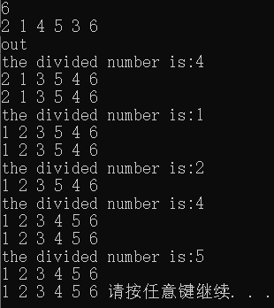
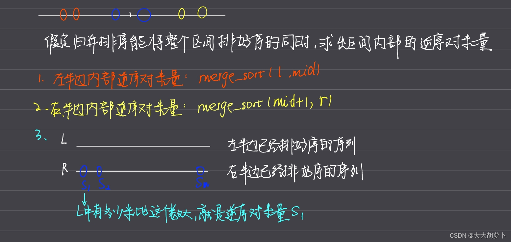
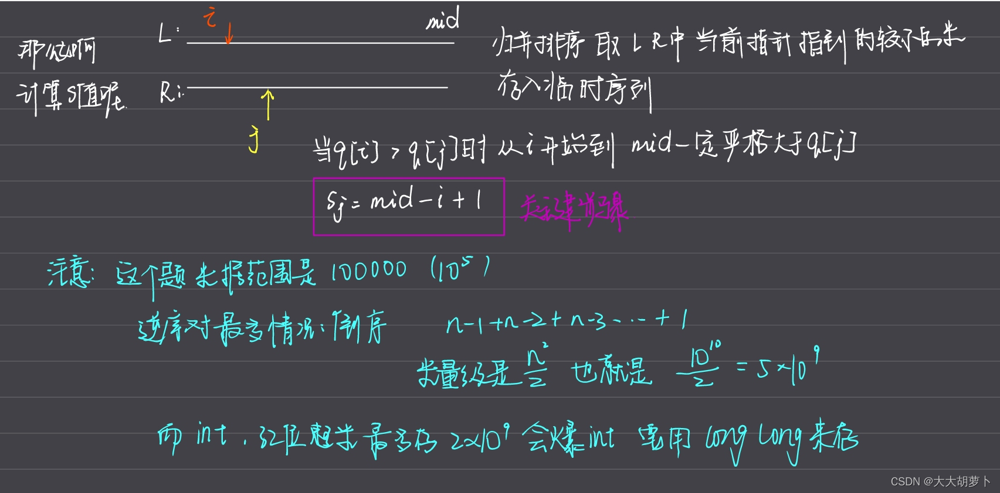

# 一 快速排序
### 快排的基本思想：基于分治
>主要思想：
>根据给定的所有数，**每次**取出一个数x作为分界，每次调整区间，使得左边区间的数都小于等于x，右边区间的数都大于等于x。递归处理左右两段。

**基本步骤**：
1.确定分界点
2.调整区间
3.递归处理
**调整区间的两种方法：** 暴力和双指针做法。
暴力：多开辟两个数组a，b，先扫描原数组q，小于等于x的存入a，大于x的存入b。最后将ab按顺序存回q。
双指针：不需要额外的空间。指针i从左向右扫描，指针j从右向左扫描。如果i碰到的数小于x那么继续右移，否则停止。j遇到的数大于x那么继续左移，否则停止。当i和j都停止的时候交换i j位置上的数。直到i和j相互穿过停止。

### 快排算法模板

```c
#include<iostream>
#include<algorithm>
using namespace std;

const int N=100010;

int q[N];//读入的要排序的数组
int n;
void quick_sort(int q[],int l,int r){
    if(l>=r) return;
    int x=q[l+r >> 1],i=l-1,j=r+1;
    cout<<"the divided number is:"<<x<<endl;
    while(i<j){
        do i++; while(q[i]<x);
        do j--; while(q[j]>x);
        if(i<j) swap(q[i],q[j]);
        for(int i=0;i<n;i++) printf("%d ",q[i]);
        cout<<endl;
    }
    quick_sort(q,l,j);
    quick_sort(q,j+1,r);
}
int main(){
    scanf("%d",&n);
    for(int i=0;i<n;i++) scanf("%d", &q[i]); 
    cout<<"out "<<endl;
    
    quick_sort(q,0,n-1);
    
    for(int i=0;i<n;i++) printf("%d ",q[i]);
    system("pause");
    return 0;
}
```
可以看一下样例输出：
<!--  -->

根据输出可以进一步理解，边界x是每一次递归调用时取的。

**注意**在取x的时候使用的位运算，右移，l+r>>1相当于做的除以2的操作，速度要快很多。

# 求第k个数
给定一个长度为 n 的整数数列，以及一个整数 k，请用快速选择算法求出数列从小到大排序后的第 k 个数。

输入格式
第一行包含两个整数 n 和 k。

第二行包含 n 个整数（所有整数均在 1∼109 范围内），表示整数数列。

输出格式
输出一个整数，表示数列的第 k 小数。

>数据范围
1≤n≤100000,
1≤k≤n

>输入样例：
5 3
2 4 1 5 3

>输出样例：
3

```c
#include<iostream>

using namespace std;

const int N=100010;

int q[N];

void quick_sort(int q[],int l,int r){
    if(l>=r) return;
    int x=q[l+r >> 1],i=l-1,j=r+1;
    while(i<j){
        do i++;while(q[i]<x);
        do j--;while(q[j]>x);
        if(i<j) swap(q[i],q[j]);
    }
    quick_sort(q,l,j);
    quick_sort(q,j+1,r);
}

int main(){
    int n,m;
    scanf("%d%d",&n, &m);
    for(int i=0;i<n;i++) scanf("%d",&q[i]);
    
    quick_sort(q,0,n-1);
    
    printf("%d",q[m-1]);
    
    return 0;
}

```

# 二 归并排序
### 归并的基本思想：基于分治
基本思想：归并排序和快速排序都是分治的思想，但是不同的是快排取的边界值是要排序的数本身，而归并取得是下标。
步骤：
1.确定分界点 mid=（l+r）/2
2.递归排序左部分和右部分
3.归并，左右两部分合二为一
>归并的方法：双指针算法。
>假设左右两部分已经排好序了，每次比较left和right的首位置的数，将比较小的数字存到临时数组里面，直到有一部分的数字已经被扫描完。最后将剩余没有扫描的一部分数字直接加到临时数组中。
### 归并算法模板

```c
#include<iostream>
using namespace std;

const int N=100010;
int q[N],temp[N];//定义额外的数组，在归并的时候使用
int n;

void merge_sort(int q[],int l,int r){
    if(l>=r) return;
    int mid = l+r >> 1;
    
    merge_sort(q,l,mid),merge_sort(q,mid+1,r);//递归排序
    //归并
    int k=0;//temp数组的下标
    int i=l,j=mid+1;
    while(i<=mid && j<=r){
        if(q[i]<=q[j]) temp[k++]=q[i++];
        else temp[k++]=q[j++];
    } 
    while(i<=mid) temp[k++]=q[i++];
    while(j<=r) temp[k++]=q[j++];
    
    for(int i=l,j=0;i<=r;i++,j++) q[i]=temp[j];
    
}
int main(){
    scanf("%d",&n);
    for(int i=0; i<n; i++) scanf("%d",&q[i]);
    
    merge_sort(q,0,n-1);
    
    for(int i=0; i<n; i++) printf("%d ",q[i]);
}
```


# 求逆序对的数量
给定一个长度为 n 的整数数列，请你计算数列中的逆序对的数量。

逆序对的定义如下：对于数列的第 i 个和第 j 个元素，如果满足 i<j 且 a[i]>a[j]，则其为一个逆序对；否则不是。

输入格式
第一行包含整数 n，表示数列的长度。

第二行包含 n 个整数，表示整个数列。

输出格式
输出一个整数，表示逆序对的个数。

>数据范围
1≤n≤100000，
数列中的元素的取值范围 [1,109]。

>输入样例：
6
2 3 4 5 6 1

>输出样例：
5




```c
#include<iostream>

using namespace std;
typedef long long LL;

const int N=100010;
int q[N],temp[N];
int n;
LL merge_sort(int q[],int l,int r){
    if(l>=r) return 0;
    int mid=l+r >> 1;
    int i=l,j=mid+1,k=0;
    
    LL res=merge_sort(q,l,mid)+merge_sort(q,mid+1,r);
    
    while(i<=mid&&j<=r){
        if(q[i]<=q[j]) temp[k++]=q[i++];
        else{
            temp[k++]=q[j++];
            res+=mid-i+1;
        }
    }
    while(i<=mid) temp[k++]=q[i++];
    while(j<=r) temp[k++]=q[j++];
    
    for(int i=l,j=0;i<=r;i++,j++) q[i]=temp[j];
    
    return res;
}

int main(){
    scanf("%d",&n);
    for(int i=0;i<n;i++) scanf("%d",&q[i]);
    cout<<merge_sort(q,0,n-1)<<endl;
}
```

# 小知识点
1.c++中数据输入很大时，使用scanf读入比cin读入快很多。
2.排序算法的稳定性：指两个数在排序之前和排序之后的相对位置是否变化。
	快排不稳定，归并是稳定的。