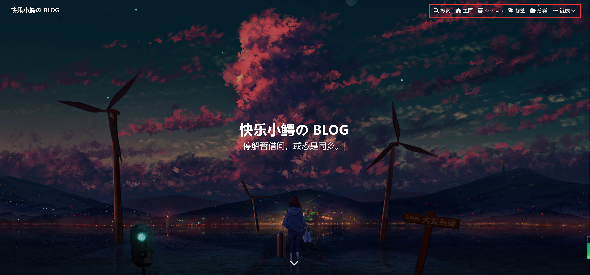
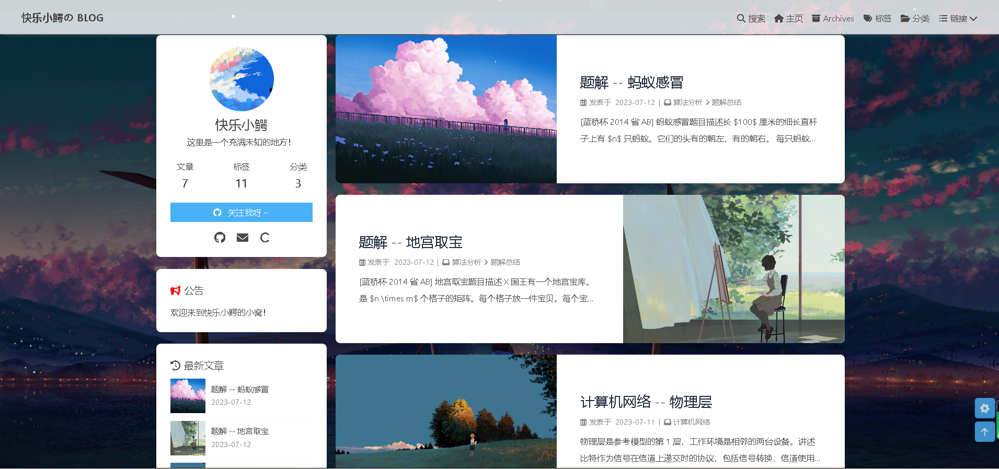
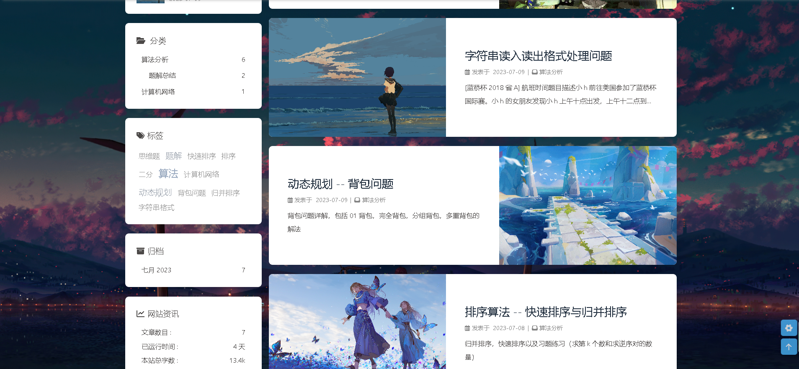
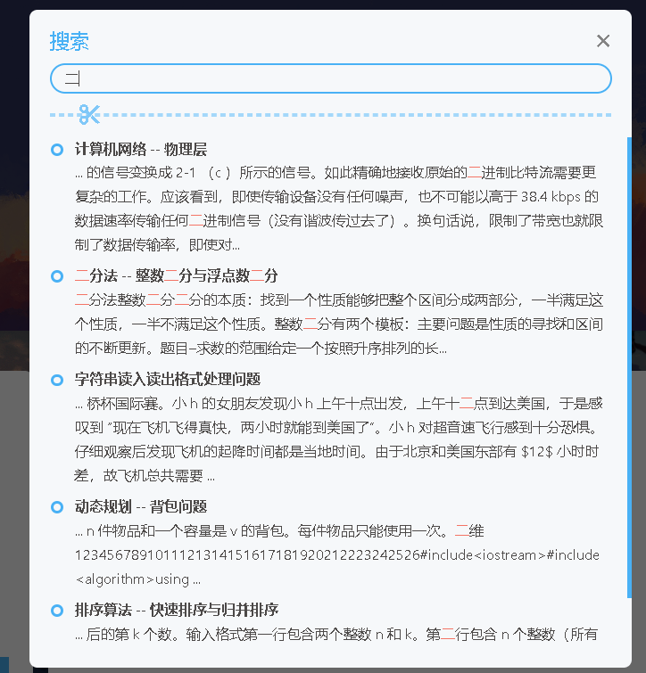

# 华东师范大学数据科学与工程学院夏令营实践项目总结反思

## 项目内容

部署一个不需要后端服务器和数据库支持的网站，只需要使用 HTML、CSS 和 JavaScript 等前端技术就可以实现的静态博客网站。静态网页博客有很多优点，比如速度快、安全稳定、易于维护等。

## 项目框架Hexo

### 为什么选用Hexo？

Hexo是一个**快速、简洁且高效**的静态网站生成引擎，它使用 Node.js 编写，并且提供了**丰富的插件和主题**来扩展和定制博客功能和外观。**本地**可以使用 Hexo 来编写和预览博客内容，通过简单的命令就能将生成的网页上传到 GitHub Pages 上。

## 博客主题Butterfly

### 为什么选择Butterfly？

1.Butterfly有**精美的界面设计**和**感官舒适的布局**，并且提供了多种样式和个性化选项，呈现出独特的风格。

2.Butterfly采用**响应式设计**，能够自适应不同的屏幕尺寸和设备类型，包括桌面电脑、平板电脑和手机等，非常方便使用各个设备访问博客。

3.Butterfly提供了**丰富的功能**和**插件**支持，包括标签云、评论系统、社交媒体分享按钮、搜索功能等。

4.Butterfly有一个活跃的**开源社区**，提供了丰富的文档和支持资源。可以通过社区获得技术支持、解决问题，并与其他博客作者交流经验和分享主题定制技巧。

### 博客页面布局以及设计思路

博客整体使用butterfly主题的设计，访问博客的主页会有一个子标题，是随机生成的诗句。右上角是导航栏，可以访问其他页面。



下拉之后的布局是左边是个人信息展示，以及文章的分类，标签还有博客相关信息的展示；右边是展示博客中的文章，选取了封面图左右分布的样式，比较美观。





下面是手机端展示的博客页面，内容与网页版相同，由于主题的响应式布局，手机端适应的也比较美观。


## 博客功能实现

- **文章归档**：展示了文章的概貌以及按照发布时间顺序排列，清晰已观看。

- **文章标签**：展示了所有文章的标签，并且根据标签被使用的次数动态调整标签展示的大小。

- **文章分类**：将文章按照分类进行整理，有利于专题式的管理文章，方便检索。

- **友情链接**：将Hexo网站以及其他可能感兴趣的网站链接进行展示。

- **关于**：展示一些个人信息。

- **搜索**：对文章的内容进行模糊查询。包括文章的标题以及文章的内容。

  

> 上述功能均基于butterfly主题框架实现~

## 遇到的问题以及解决方法

### Hexo框架安装

在安装Hexo框架时会出现安装过程卡住以及安装失败的问题。以为是nodejs版本以及npm版本的问题，升级之后依然安装失败，查阅资料之后，得出有可能是网络延迟或者电脑安全软件的原因。换了网络以及关掉相应软件后按照成功。

### Hexo初始化

执行到 [hexo](https://so.csdn.net/so/search?q=hexo&spm=1001.2101.3001.7020) init命令，即初始化阶段时，在clone完hexo初始化仓库后，卡在安装依赖的界面，如下所示：

```
$ hexo init
INFO Cloning hexo-starter https://github.com/hexojs/hexo-starter.git
INFO Install dependencies
```

解决方法：退出当前命令，在当前文件夹手动执行npm install安装依赖。

### 图片显示问题

在写博客时需要插入图片，可以选用插入外链接的方法，也可以使用本地存储图片的方式。

我使用的是将图片保存在本地img文件夹，然后在markdown文档中引用的方法，但是一直无法正确显示。

查找资料找到了以下的解决方案：

- **设置站点配置_config.yml**：

  post_asset_folder: true

  表示在生成的文章目录中创建一个与文章同名的文件夹，并将文章相关的资源文件（如图像、视频等）放置在该文件夹中。

- **安装插件**：

  npm install hexo-asset-image -- save

- **引用图片**：

  运行hexo new "xxxx"来生成markdown博文时，/source/_posts文件夹内除了xxxx.md文件还有一个同名的文件夹。

  在xxxx.md中想引入图片时，先把图片复制到xxxx这个文件夹中，然后只需要在xxxx.md中按照markdown的格式引入图片即可。


## 总结

本次项目使用Hexo+Github Page搭建了个人静态博客网站，学习了Hexo的实现命令，掌握了快速搭建博客的方法，使用git进行版本控制，防止代码丢失或者错乱。


